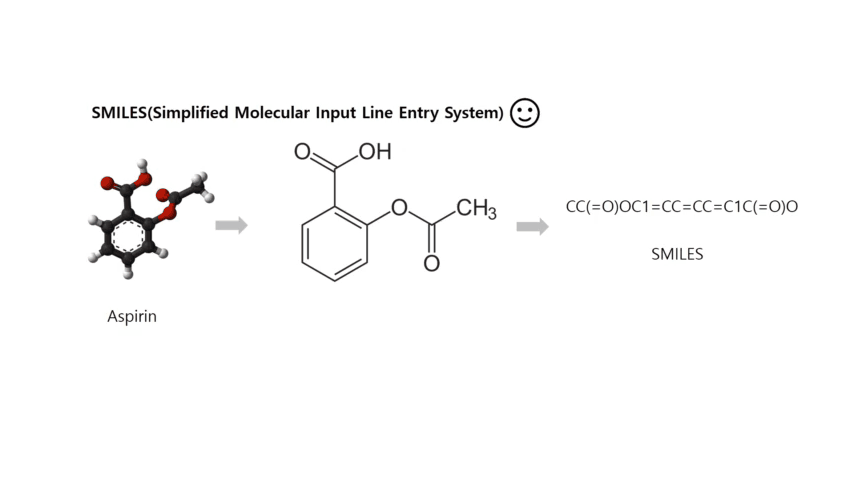
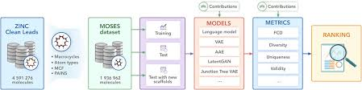
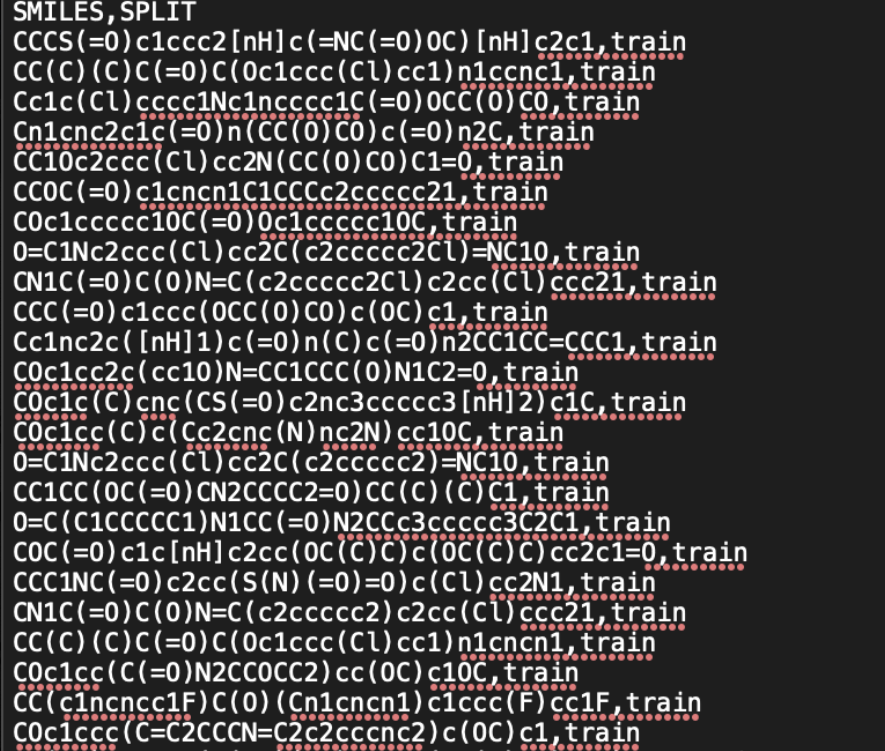
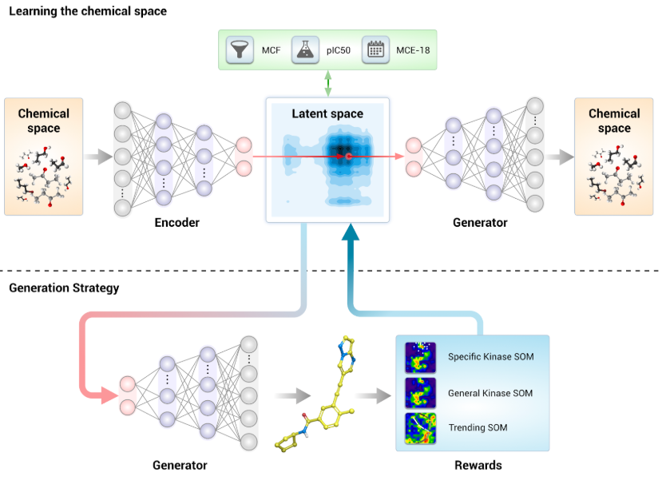

Welcome 👋



# Insilico Medicine: Applying AI to Reduce Costs in Drug Discovery

In this blog, I'm sharing my research notes on Insilico Medicine and their use of the AAE architecture for drug-dicovery and molecule generation. Enjoy!

## Introduction

Conventional drug development has always been an uphill struggle. The American Society of Biochemistry and Molecular Biology reports that it **“takes 10 to 15 years and around US$1 billion to develop a successful drug”**, but despite these large investments in time and money, **“90% of drug candidates in clinical trials fail”**.

Amidst this pressing need to reduce costs, pioneering startups such as **Insilico Medicine** have been leveraging big data science to transform how drugs are developed. Based in Hong Kong, Insilico Medicine is a biotechnology AI startup that has developed an **“end-to-end” AI platform** capable of identifying a disease **“target”** and virtually generating suitable chemical molecules with therapeutic properties.

## Breakthrough in Cost and Time Efficiency

Insilico Medicine’s application of **deep generative networks** to drug discovery has exponentially reduced costs. Using their AI platform, Insilico developed a drug for Phase 1 trials targeting **fibrosis** in **18 months** at an estimated cost of **~USD 2.6 million**—just **10% of the cost** of conventional drug development.

---

## Data Overview
To achieve this, Insilico Medicine first leveraged large amounts of compiled datasets and a variety of data types and attributes. Insilico Medicine tapped into an open-sourced chemical dataset (“ZINC”) by John J. Irwin and Brian K. Shoichet. With over 35 million compounds available, the ZINC dataset was formed through data aggregation from 10 vendor catalogs of molecular data stored as a 2D Structured Data File (SDF). 

The authors transformed the 2D SDF data to nominal string data with the internationally-recognized SMILES representations. SMILES transforms the input 2D molecule design and describes its chemical and structural properties in ASCII strings. For example, Aspirin’s structure can be represented as the following using SMILES (Figure 1). 

Data quality was checked and cleaned. Checking for data completeness and consistency, data instances with missing values, inconsistently formatted data, and duplicates were removed. 

To ensure the dataset is valid for drug discovery, additional attributes were created, namely: molecular weight, # Hydrogen-Bond donors, # of Hydrogen Bond Acceptors, # of rotatable bonds, XLogP.

Based on commonly understood properties of compounds, a criteria was set to filter instances that are considered “biologically relevant” (Table 1 and FIgure 2). Ultimately, a subset of training data called “MOSES” was developed, consisting of 1,936,962 molecules in total. 

### ZINC Dataset
- **Source**: Open-sourced chemical dataset curated by John J. Irwin and Brian K. Shoichet.
- **Size**: Over **35 million compounds** aggregated from 10 vendor catalogs.
- **Format**: Originally stored as **2D Structured Data Files (SDF)**, converted to **SMILES representations** (ASCII strings describing chemical structures).

  **Example**: Aspirin’s SMILES string: `O=C(C)Oc1ccccc1C(=O)O`  
  
  **Figure 1**: SMILES Representation of Aspirin.

### Data Cleaning & Validation
- Removed instances with:
  - Missing values
  - Inconsistent formatting
  - Duplicates
- Added critical attributes for biological relevance:
  - Molecular weight
  - Hydrogen-bond donors/acceptors
  - Rotatable bonds
  - XLogP (measure of lipophilicity)

### Filtering Criteria (MOSES Sub-dataset)
| Attribute                 | Filter Criteria                     |
|---------------------------|-------------------------------------|
| Molecular Weight          | 250–350 Daltons                    |
| XLogP                     | ≤3.5                               |
| Hydrogen-Bond Donors      | ≤6                                 |
| Hydrogen-Bond Acceptors   | ≤11                                |
| Rotatable Bonds           | ≤15                                |
| Permitted Atoms           | C, N, S, O, F, Cl, Br, H           |
| Excluded Features         | Charged atoms, atomic cycles >8    |
**Table 1**: Instance selection criteria for the MOSES dataset.  

**Figure 2**: MOSES dataset processed from ZINC.

### Dataset Partitioning
Afterwards, Insilico Medicine partitioned the dataset into three sets of subsets, namely: Training (around >80% for training with 1.6M instances), Test (<10% with 176K instances), and Test with New Scaffolds (<10%  with 176k instances). The Training set will be dedicated to train the AI model, the test will be used to evaluate the performance of the trained model, and the “Test with new scaffolds” will be used to assess how the model responds to molecules that have not been seen before (Figure 3). 

- **Training**: >80% (~1.6M molecules)
- **Test**: <10% (~176K molecules)
- **Test with New Scaffolds**: <10% (~176K molecules) 

**Figure 3**: Example of training data distribution.

---

## How Data is Leveraged
Based on the MOSES dataset, Insilico Medicine utilized “Adversarial Autoencoders” (AAE) to train various generative chemistry models that can generate “virtual” molecules (Figure 4). Insilico Medicine trained an adaptation of the Adversarial Autoencoders (AAE) that generates a SMILES string representation as output . 

### Adversarial Autoencoders (AAE)
The AAE consists of three main portions: an encoder, latent space, and generator. The encoder is a recurrent neural network that captures the statistical variances in the ~1.6M training instances of molecules in the MOSES dataset, and outputs a vector of 50 dimensions called the “Latent Space”, which captures the molecule variations within the MOSES training set. 

During training, Insilico Medicine used a prepared dataset and trained the AAE model to output the same SMILES molecule back. To optimize the model, three rewards functions were calculated: the trending SOM, General Kinases SOM, and the Specific Kinase SOM. Using principles of backpropagation and the Adam optimizer, the model was trained with a learning rate of 0.0001 and optimized for 300K updates. 

For inference, Insilico Medicine then used the “Latent Space” and “generator” portions of the model to recreate virtual organic molecules. With this, Insilico Medicine generated over 30,000 different molecules. The results were then binned based on chemical properties to ultimately be reduced down to 40 proposing drug molecules. 

1. **Encoder**: Recurrent neural network capturing statistical variances in training data.
2. **Latent Space**: 50-dimensional vector encoding molecule variations.
3. **Generator**: Produces novel SMILES strings representing molecules.

**Figure 4**: Architecture of Insilico Medicine’s GENTRL model.

### Training Process
- **Objective**: Reconstruct input SMILES strings.
- **Reward Functions**: 
  - Trending SOM
  - General Kinases SOM
  - Specific Kinase SOM
- **Optimization**: Adam optimizer with a learning rate of 0.0001 for 300K updates.

### Molecule Generation
- Generated **30,000 virtual molecules**.
- Filtered to **40 candidate molecules** based on chemical properties.

---

## Challenges

1. **Limited Data on Approved Drugs**:  
Whilst transformative, there are still foreseeable challenges with using AI/ML in drug development. The most notable one is, despite there being a large amount of data for general molecules, the data size for approved drug compounds is limited. As a result, the existing AI model only performs well in generative chemical compounds, but may not be optimized to predict which chemical compounds are most likely to succeed and be approved by the FDA. This is still an on-going area of research Insilico Medicine is working on.

2. **Social & Cultural Barriers**:  
Furthermore, the concept of developing drugs in-silico is still a novel topic and the adoption of drugs developed by Insilico Medicine may have to overcome social and cultural barriers. As the drug development process was done by a neural network, rather than researchers, there is less opacity in how the drug was developed and may be hard for doctors to explain to their patients about how this drug was formed. There is also little understanding on how patients will feel if they are taking a drug that was developed by AI. 

---

## Conclusion

Overall, Insilico Medicine has pioneered an innovative method to apply big data and is set to transform the world through its AI application in drug discovery. 

---

## Sources
- <https://www.ncbi.nlm.nih.gov/pmc/articles/PMC1360656/pdf/nihms2574.pdf>
- <https://insilico.com/blog/pcc>
- <https://github.com/insilicomedicine/GENTRL>
- <https://www.nature.com/articles/d43747-021-00039-5>
- <https://github.com/molecularsets/moses>
- <https://www.nature.com/articles/s41587-019-0224-x>
- <https://arxiv.org/abs/1811.12823>
- <https://insilico.com/phase1>
- <https://arxiv.org/pdf/1610.02415.pdf>